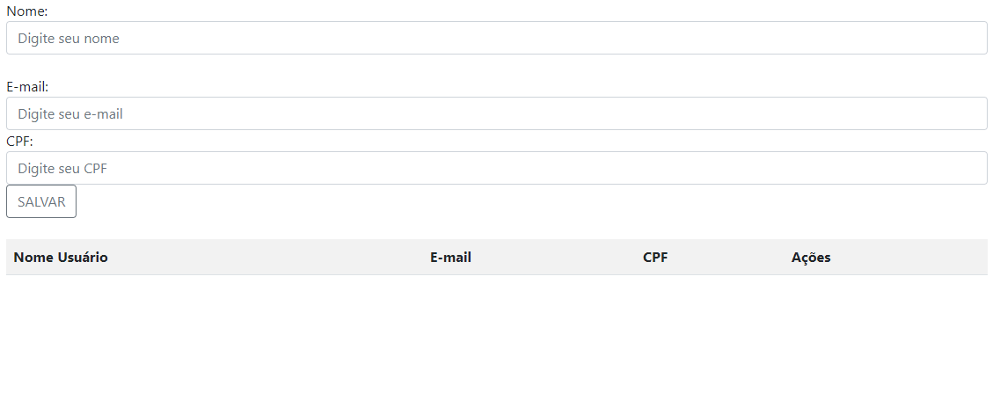

<h1 align = "center"

Login/Cadastro 📋

<h1 align = "center"

Tela de Login


<h1 align = "center"

Tela de cadastro



<h1 align = "center">

Elementos do JavaScript utilizado:

</h1>

>* ``Array``
>Cria elementos.
>* ``Button``
>É um elemento interativo ativado por um usuário com mouse, teclado, dedo, comando de voz ou outra tecnologia assistiva. Uma vez ativado, ele executa uma ação, como enviar um formulário ou abrir uma caixa de diálogo.

>* ``Splice``
>Remove e adiciona elementos do array


# 🛠️Tecnologias Utilizadas
>* ``HTML5``
>* ``CSS3``
>* ``Github`` 
>* ``Git``
>* ``Vscode``
>* ``JS``

##  🛠️Funcionalidades
>- Coleta de informações do remetente, como endereço de e-mail e senha
>- Validação dos dados inseridos para garantir que sejam fornecidos corretamente.
>- Notificação por e-mail ou armazenamento em um banco de dados para acompanhar as informações recebidas.

# Desenvolvedor do projeto
* [eduardoocosta](https://github.com/eduardoocosta)
* [duardoosta](https://www.instagram.com/duardooosta)

## 🔗 Links
[](https://katherineoelsner.com/)
[](https://www.linkedin.com/)


# Explicação do Placeholder
## Placeholder deixa fixado a mensagem que está dentro do Input
>


## Rodando localmente

Clone o projeto

```bash
  git clone https://github.com/eduardoocosta/login-cade
```

Entre no diretório do projeto

```bash
  cd my-project
```

Instale as dependências

```bash
  npm install
```

Inicie o servidor

```bash
  npm run start
```


